# SAIF Automations - Manufacturing ERP Application Flowchart

## 📊 Complete System Flow Diagram

```mermaid
graph TB
    Start([User Access]) --> Login{Authentication}
    Login -->|Success| Dashboard[Dashboard Home]
    Login -->|Failed| Start
    
    Dashboard --> Purchase[Purchase Module]
    Dashboard --> Inventory[Inventory Module]
    Dashboard --> Production[Production Module]
    Dashboard --> Sales[Sales & Dispatch]
    Dashboard --> Quality[Quality Control]
    Dashboard --> Service[After-Sales Service]
    Dashboard --> HR[Human Resources]
    Dashboard --> Settings[Settings & Admin]
    Dashboard --> UID[UID Tracking]
    Dashboard --> BOM[Bill of Materials]
    
    %% Purchase Flow
    Purchase --> PR[Purchase Requisition]
    PR --> PRCreate[Create PR]
    PRCreate --> PRApproval{Approval Required?}
    PRApproval -->|Yes| PRApprove[Approve PR]
    PRApproval -->|No| PO[Purchase Order]
    PRApprove --> PO
    
    PO --> POCreate[Create PO]
    POCreate --> POSend[Send to Vendor]
    POSend --> GRN[Goods Receipt Note]
    
    GRN --> GRNCreate[Create GRN]
    GRNCreate --> GRNInspect[Quality Inspection]
    GRNInspect --> GRNAccept{Accept Items?}
    GRNAccept -->|Yes| GRNStock[Update Stock]
    GRNAccept -->|No| GRNReject[Reject Items]
    GRNStock --> UIDGen1[Generate UIDs]
    UIDGen1 --> StockEntry[Create Stock Entry]
    
    %% Inventory Flow
    Inventory --> Items[Item Master]
    Items --> ItemCreate[Create/Edit Items]
    ItemCreate --> ItemCategory[Set Category]
    ItemCategory --> ItemUOM[Set UOM]
    ItemUOM --> ItemVendor[Link Vendors]
    
    Inventory --> Stock[Stock Management]
    Stock --> StockView[View Stock Levels]
    StockView --> StockAdjust[Stock Adjustment]
    StockAdjust --> StockReason[Enter Reason]
    
    Inventory --> Locations[Storage Locations]
    Locations --> LocCreate[Create Location]
    LocCreate --> LocAssign[Assign Items]
    
    %% BOM Flow
    BOM --> BOMCreate[Create BOM]
    BOMCreate --> BOMHeader[BOM Header Info]
    BOMHeader --> BOMItems[Add BOM Items]
    BOMItems --> BOMMultiLevel{Multi-Level?}
    BOMMultiLevel -->|Yes| BOMChild[Add Child BOMs]
    BOMMultiLevel -->|No| BOMRouting[Define Routing]
    BOMChild --> BOMRouting
    BOMRouting --> BOMOps[Add Operations]
    BOMOps --> BOMWorkstation[Assign Workstations]
    
    %% Production Flow
    Production --> JobOrder[Job Orders]
    JobOrder --> JOCreate[Create Job Order]
    JOCreate --> JOBOMSelect[Select BOM]
    JOBOMSelect --> JOQuantity[Enter Quantity]
    JOQuantity --> JOMaterials[Auto-calc Materials]
    JOMaterials --> JOIssue[Issue Materials]
    JOIssue --> JOConsumeUID[Consume UIDs]
    
    JOConsumeUID --> JOProduce[Start Production]
    JOProduce --> JOWorkstation[Assign Workstation]
    JOWorkstation --> JOProgress[Track Progress]
    JOProgress --> JOComplete{Complete?}
    JOComplete -->|No| JOProgress
    JOComplete -->|Yes| JOFinish[Complete Job Order]
    JOFinish --> UIDGen2[Generate Product UIDs]
    UIDGen2 --> JOStockUpdate[Update Finished Goods]
    
    %% Sales Flow
    Sales --> Quote[Quotations]
    Quote --> QuoteCreate[Create Quote]
    QuoteCreate --> QuoteItems[Add Items]
    QuoteItems --> QuoteSend[Send to Customer]
    QuoteSend --> QuoteConvert{Convert to SO?}
    QuoteConvert -->|Yes| SO[Sales Order]
    QuoteConvert -->|No| QuoteRevise[Revise Quote]
    
    SO --> SOCreate[Create Sales Order]
    SOCreate --> SOItems[Add SO Items]
    SOItems --> SOConfirm[Confirm Order]
    SOConfirm --> Dispatch[Dispatch]
    
    Dispatch --> DispatchCreate[Create Dispatch Note]
    DispatchCreate --> DispatchItems[Select Items]
    DispatchItems --> DispatchUID[Select UIDs]
    DispatchUID --> DispatchQty[Enter Quantity]
    DispatchQty --> DispatchShip[Ship Items]
    DispatchShip --> UIDTransit[Update UID Status]
    UIDTransit --> Invoice[Generate Invoice]
    
    %% Quality Flow
    Quality --> QCPlan[QC Plans]
    QCPlan --> QCCreate[Create QC Plan]
    QCCreate --> QCParams[Define Parameters]
    QCParams --> QCInspect[Inspection]
    
    QCInspect --> QCReceiving[Receiving Inspection]
    QCReceiving --> QCInProcess[In-Process QC]
    QCInProcess --> QCFinal[Final Inspection]
    QCFinal --> QCResult{Pass/Fail?}
    QCResult -->|Pass| QCApprove[Approve Items]
    QCResult -->|Fail| QCReject2[Reject Items]
    QCApprove --> QCUpdateUID[Update UID Quality]
    
    %% Service Flow
    Service --> ServiceReq[Service Request]
    ServiceReq --> SRCreate[Create SR]
    SRCreate --> SRAssign[Assign Technician]
    SRAssign --> SRSchedule[Schedule Visit]
    SRSchedule --> SRExecute[Execute Service]
    SRExecute --> SRParts[Use Spare Parts]
    SRParts --> SRComplete[Complete Service]
    SRComplete --> SRInvoice[Service Invoice]
    
    Service --> Warranty[Warranty Management]
    Warranty --> WarrantyCheck[Check Warranty]
    WarrantyCheck --> WarrantyValid{Valid?}
    WarrantyValid -->|Yes| WarrantyService[Free Service]
    WarrantyValid -->|No| WarrantyPaid[Paid Service]
    
    %% HR Flow
    HR --> Employees[Employee Management]
    Employees --> EmpCreate[Create Employee]
    EmpCreate --> EmpDetails[Enter Details]
    EmpDetails --> EmpDept[Assign Department]
    EmpDept --> EmpSalary[Set Salary]
    
    HR --> Attendance[Attendance]
    Attendance --> AttMark[Mark Attendance]
    AttMark --> AttView[View Records]
    
    HR --> Payroll[Payroll]
    Payroll --> PayCalc[Calculate Salary]
    PayCalc --> PayDeduct[Apply Deductions]
    PayDeduct --> PayGenerate[Generate Payslip]
    
    HR --> Leave[Leave Management]
    Leave --> LeaveApply[Apply Leave]
    LeaveApply --> LeaveApprove{Approve?}
    LeaveApprove -->|Yes| LeaveGrant[Grant Leave]
    LeaveApprove -->|No| LeaveReject[Reject Leave]
    
    %% UID Flow
    UID --> UIDView[View All UIDs]
    UIDView --> UIDFilter[Filter by Status]
    UIDFilter --> UIDDetails[View Details]
    
    UID --> UIDTrace[Trace UID]
    UIDTrace --> UIDEnter[Enter UID]
    UIDEnter --> UIDHistory[View Full History]
    UIDHistory --> UIDLifecycle[Lifecycle Stages]
    UIDLifecycle --> UIDLocation[Current Location]
    
    %% Settings Flow
    Settings --> Company[Company Settings]
    Company --> CompDetails[Company Details]
    CompDetails --> CompLogo[Upload Logo]
    
    Settings --> Users[User Management]
    Users --> UserCreate[Create User]
    UserCreate --> UserRole[Assign Roles]
    UserRole --> UserPerms[Set Permissions]
    
    Settings --> Roles[Role Management]
    Roles --> RoleCreate[Create Role]
    RoleCreate --> RolePerms[Define Permissions]
    
    Settings --> Integration[Integrations]
    Integration --> IntAPI[API Keys]
    IntAPI --> IntWebhook[Webhooks]
    
    %% Common endpoints
    StockEntry --> Dashboard
    JOStockUpdate --> Dashboard
    Invoice --> Dashboard
    SRInvoice --> Dashboard
    PayGenerate --> Dashboard
    
    style Dashboard fill:#4CAF50,stroke:#2E7D32,stroke-width:3px,color:#fff
    style Purchase fill:#2196F3,stroke:#1565C0,color:#fff
    style Inventory fill:#FF9800,stroke:#E65100,color:#fff
    style Production fill:#9C27B0,stroke:#6A1B9A,color:#fff
    style Sales fill:#F44336,stroke:#C62828,color:#fff
    style Quality fill:#00BCD4,stroke:#00838F,color:#fff
    style Service fill:#FFC107,stroke:#F57C00,color:#fff
    style HR fill:#8BC34A,stroke:#558B2F,color:#fff
    style UID fill:#E91E63,stroke:#AD1457,color:#fff
    style BOM fill:#3F51B5,stroke:#1A237E,color:#fff
    style Settings fill:#607D8B,stroke:#37474F,color:#fff
```

---

## 🔄 Core Process Flows

### 1. Purchase-to-Stock Flow
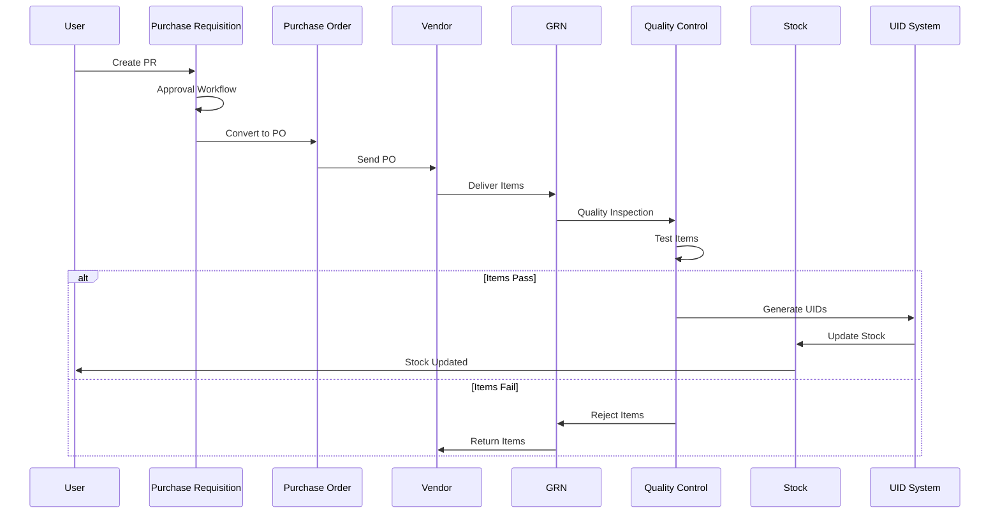

### 2. Production Flow with UID Tracking
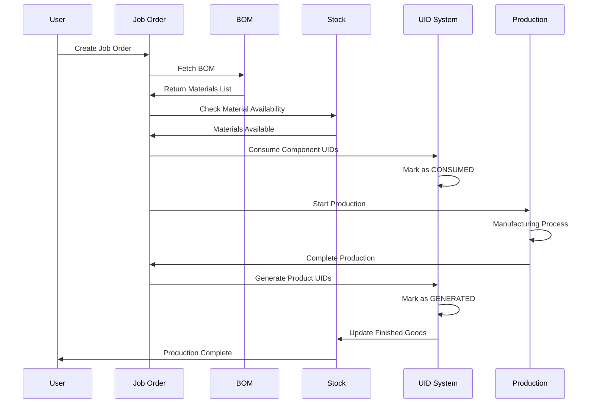

### 3. Sales & Dispatch Flow
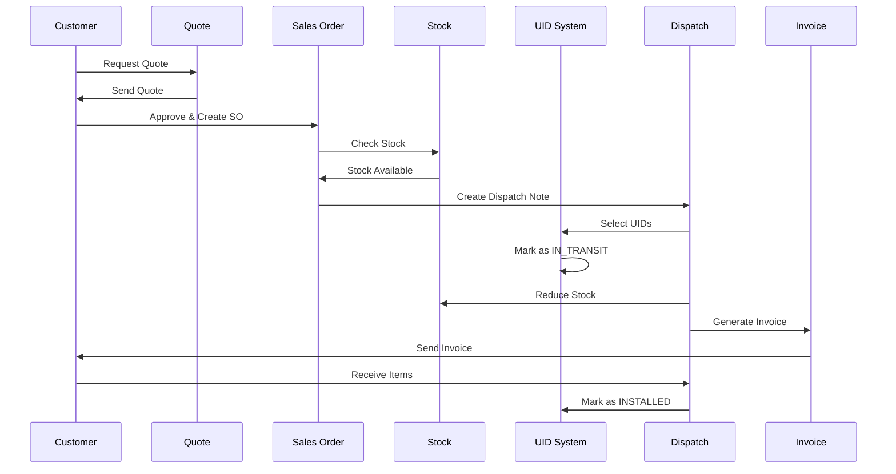

### 4. Multi-Level BOM Explosion
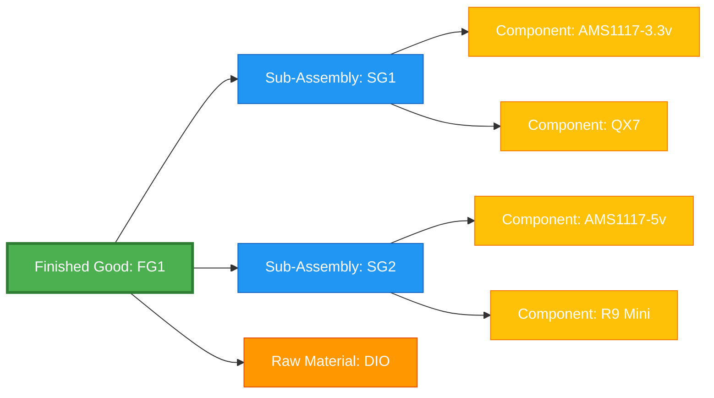

---

## 🎯 Module Interconnections

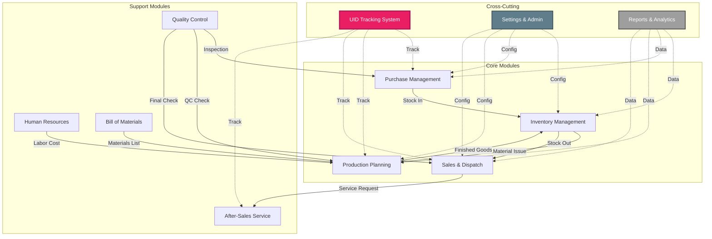

---

## 🔐 Access Control Flow

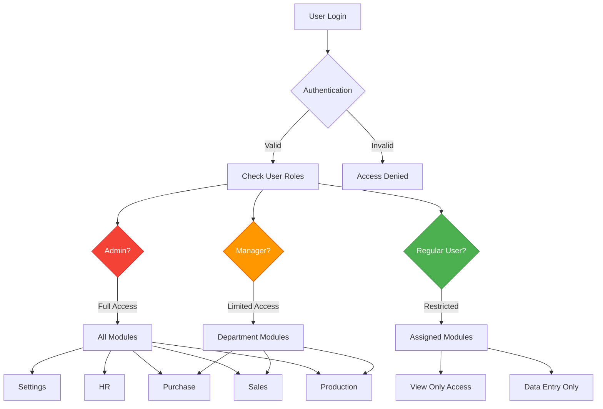

---

## 📱 User Journey Maps

### Production Manager Journey
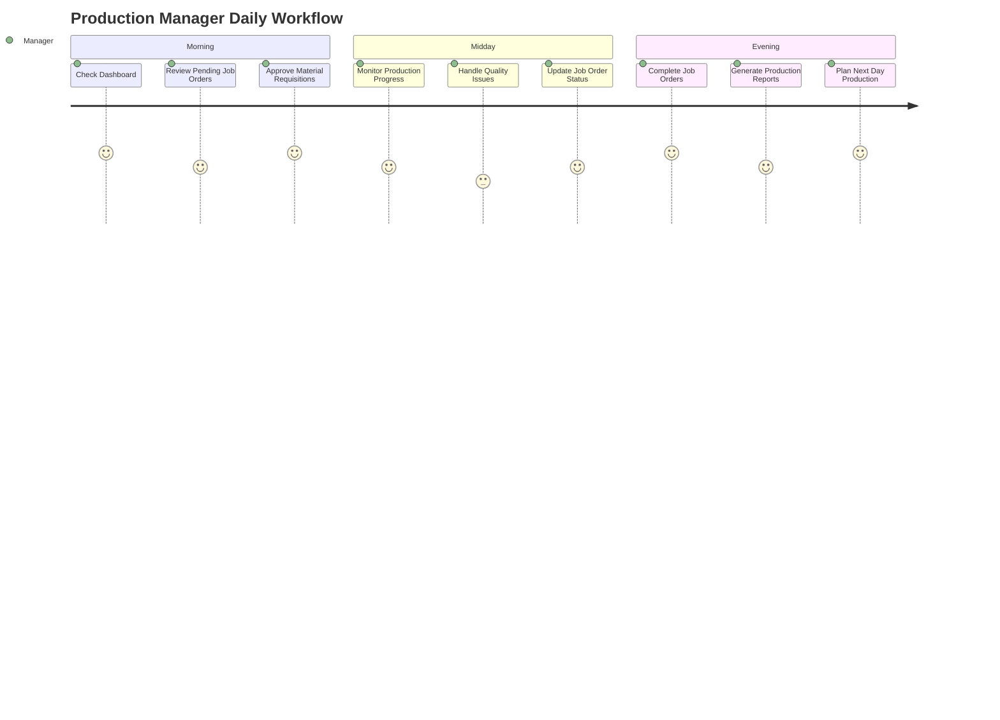

### Purchase Officer Journey
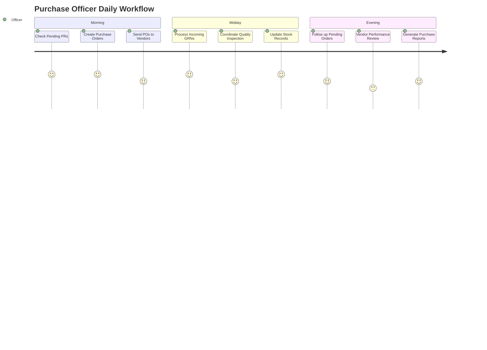

---

## 🔄 Data Flow Architecture

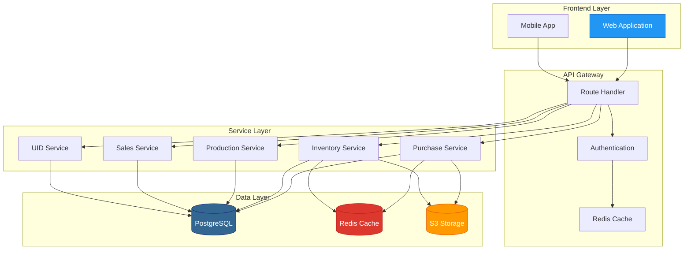

---

## 📊 Integration Points

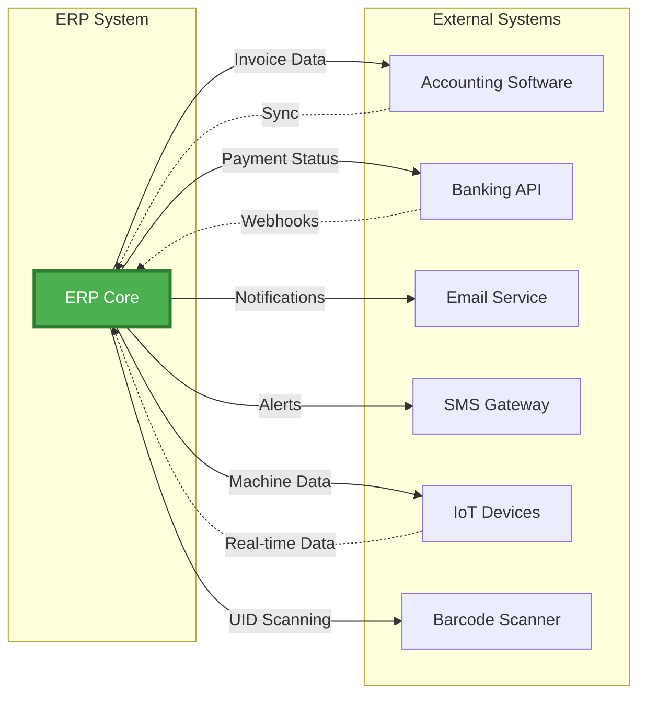

---

## 🎯 Critical Success Paths

### Path 1: Procurement to Stock
1. **Purchase Requisition** → Approval → Purchase Order
2. **Purchase Order** → Vendor → Goods Receipt
3. **Goods Receipt** → Quality Check → Stock Entry
4. **Stock Entry** → UID Generation → Inventory Update

### Path 2: Stock to Production
1. **Job Order Creation** → BOM Selection → Material Calculation
2. **Material Issue** → UID Consumption → Production Start
3. **Production Progress** → Workstation Tracking → Quality Check
4. **Production Complete** → UID Generation → Finished Goods Stock

### Path 3: Stock to Customer
1. **Quotation** → Customer Approval → Sales Order
2. **Sales Order** → Stock Allocation → Dispatch Note
3. **Dispatch Note** → UID Selection → Shipping
4. **Shipping** → UID Transit → Customer Receipt → Invoice

---

## 📈 System States & Transitions

### Job Order States
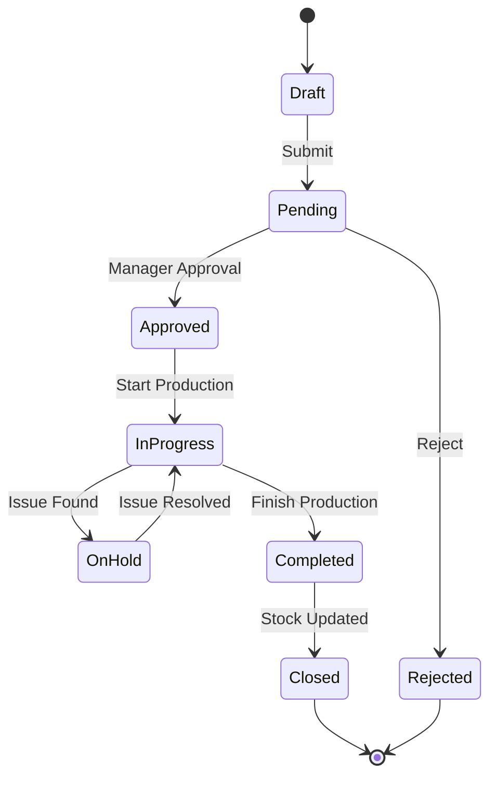

### UID Lifecycle States
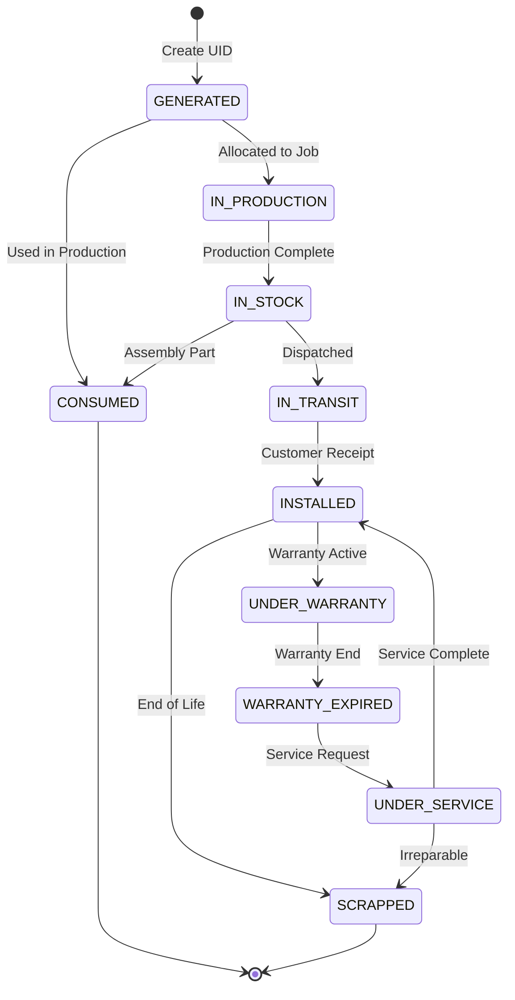

---

## 🛠️ Technical Architecture Flow

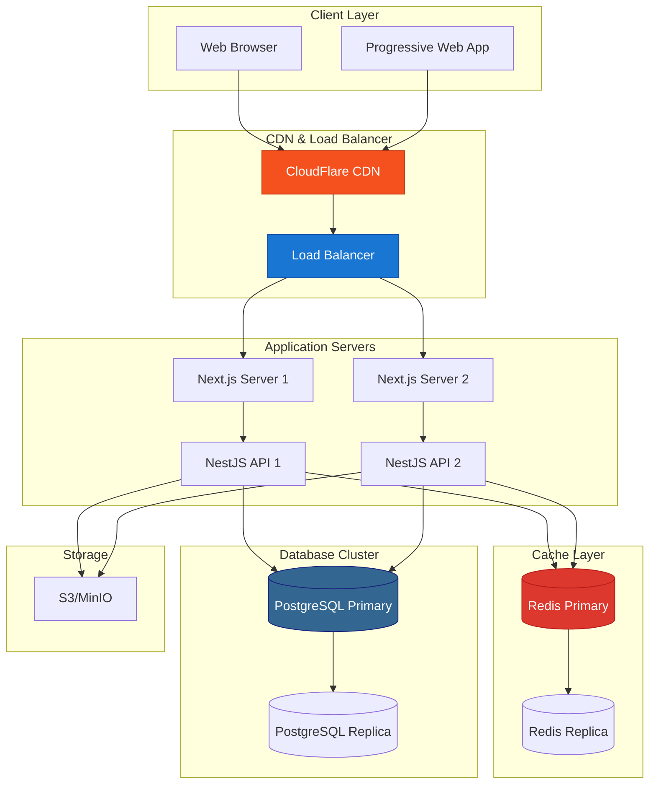

---

## 📋 Feature Matrix

| Module | Create | Read | Update | Delete | Export | Import | Print |
|--------|--------|------|--------|--------|--------|--------|-------|
| Purchase | ✅ | ✅ | ✅ | ✅ | ✅ | ❌ | ✅ |
| Inventory | ✅ | ✅ | ✅ | ✅ | ✅ | ✅ | ✅ |
| Production | ✅ | ✅ | ✅ | ✅ | ✅ | ❌ | ✅ |
| Sales | ✅ | ✅ | ✅ | ✅ | ✅ | ❌ | ✅ |
| Quality | ✅ | ✅ | ✅ | ✅ | ✅ | ❌ | ✅ |
| Service | ✅ | ✅ | ✅ | ✅ | ✅ | ❌ | ✅ |
| HR | ✅ | ✅ | ✅ | ✅ | ✅ | ✅ | ✅ |
| UID | ✅ | ✅ | ✅ | ❌ | ✅ | ❌ | ✅ |
| BOM | ✅ | ✅ | ✅ | ✅ | ✅ | ❌ | ✅ |

---

## 🎨 UI/UX Flow

### Dashboard Navigation
```
┌─────────────────────────────────────────────────────────────┐
│  SAIF ERP                    [Search]  🔔 [Notifications] 👤  │
├─────────────────────────────────────────────────────────────┤
│                                                              │
│  📊 Dashboard                                                │
│  🛒 Purchase        → PR | PO | GRN | Vendors               │
│  📦 Inventory       → Items | Stock | Locations             │
│  🏭 Production      → Job Orders | Workstations | Shop Floor│
│  💰 Sales           → Quotes | Orders | Dispatch            │
│  ✅ Quality         → QC Plans | Inspections                │
│  🔧 Service         → Service Requests | Warranty           │
│  👥 HR              → Employees | Attendance | Payroll      │
│  🏷️  UID Tracking   → All UIDs | Trace | History            │
│  📋 BOM             → BOMs | Routing | Components           │
│  ⚙️  Settings       → Company | Users | Roles               │
│                                                              │
└─────────────────────────────────────────────────────────────┘
```

---

## 🔍 Key Workflows Summary

### Procurement Workflow
1. Create Purchase Requisition
2. Manager Approval
3. Convert to Purchase Order
4. Send to Vendor
5. Receive Goods (GRN)
6. Quality Inspection
7. Accept → Generate UIDs → Update Stock
8. Reject → Return to Vendor

### Production Workflow
1. Create Job Order
2. Select BOM (Multi-level support)
3. Auto-calculate Material Requirements
4. Issue Materials (Consume UIDs)
5. Start Production
6. Track Progress on Shop Floor
7. Complete Production
8. Generate Product UIDs
9. Update Finished Goods Stock

### Sales & Dispatch Workflow
1. Create Quotation
2. Customer Approval
3. Convert to Sales Order
4. Create Dispatch Note
5. Select Items & UIDs
6. Generate Invoice
7. Ship Items (Update UID status)
8. Customer Receipt

### UID Lifecycle Workflow
1. **GENERATED**: Created at GRN or Production
2. **IN_PRODUCTION**: Allocated to Job Order
3. **IN_STOCK**: Available in warehouse
4. **IN_TRANSIT**: Dispatched to customer
5. **INSTALLED**: At customer location
6. **UNDER_WARRANTY**: Active warranty period
7. **UNDER_SERVICE**: Being serviced
8. **CONSUMED**: Used in assembly
9. **SCRAPPED**: End of life

---

## 📞 Support & Documentation

For detailed module documentation, refer to:
- `ARCHITECTURE.md` - Technical architecture
- `DEPLOYMENT_README.md` - Deployment guide
- Module-specific README files in each service directory

---

**Document Version**: 1.0  
**Last Updated**: December 5, 2025  
**Maintained By**: SAIF Automations Development Team
