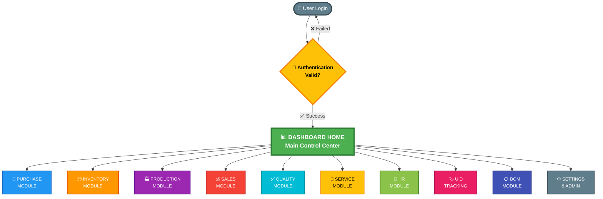
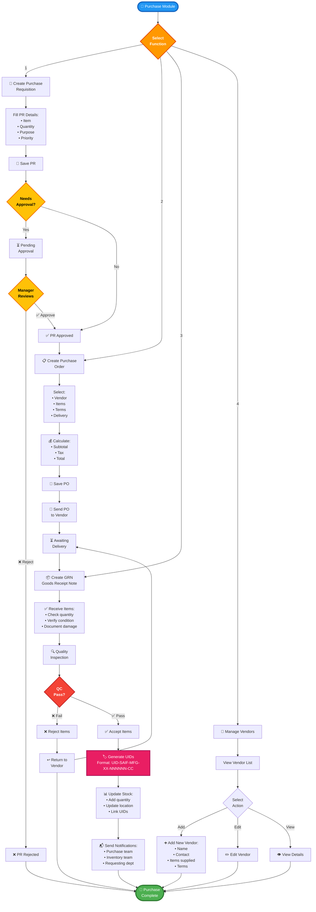
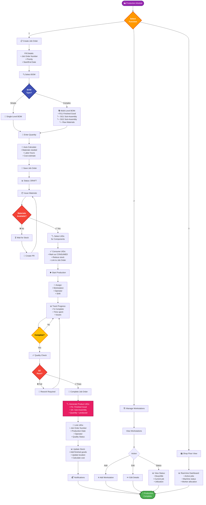
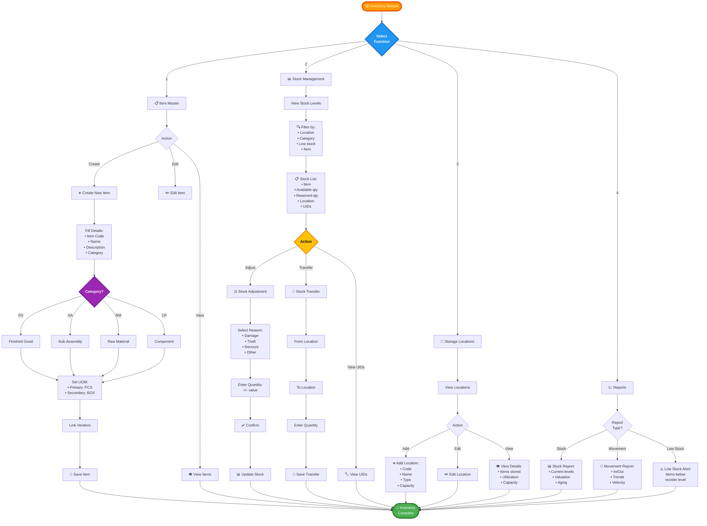
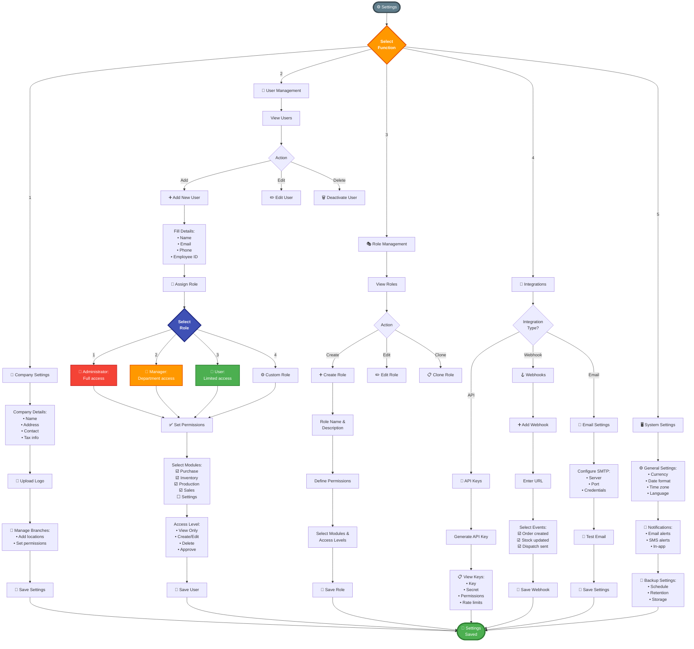

# SAIF ERP - Visual Flowcharts

## 📊 How to View These Flowcharts

These Mermaid diagrams can be:
1. **Viewed on GitHub** - Automatically rendered
2. **Exported as PNG/SVG** - Use [Mermaid Live Editor](https://mermaid.live/)
3. **VS Code** - Install "Markdown Preview Mermaid Support" extension
4. **Copy to draw.io** - For further customization

---

## 🎯 Main Application Flow - Hierarchical View



---

## 🛒 PURCHASE MODULE - Complete Flow



---

## 🏭 PRODUCTION MODULE - Complete Flow



---

## 💰 SALES & DISPATCH MODULE - Complete Flow

```mermaid
flowchart TD
    Start([💰 Sales Module]) --> Choice{Select<br/>Function}
    
    %% Quotation Flow
    Choice -->|1| Quote[📄 Create Quotation]
    Quote --> QForm[Fill Details:<br/>• Customer<br/>• Items<br/>• Quantity<br/>• Price]
    QForm --> QCalc[💰 Calculate:<br/>• Subtotal<br/>• Discounts<br/>• Tax<br/>• Total]
    QCalc --> QSave[💾 Save Quotation]
    QSave --> QSend[📧 Send to Customer]
    QSend --> QWait[⏳ Awaiting Response]
    QWait --> QResponse{Customer<br/>Decision?}
    
    QResponse -->|❌ Reject| QRevise{Revise?}
    QRevise -->|Yes| QForm
    QRevise -->|No| QClose[❌ Close Quote]
    
    QResponse -->|✅ Approve| QConvert[✅ Convert to<br/>Sales Order]
    
    %% Sales Order Flow
    QConvert --> SO[📋 Sales Order]
    Choice -->|2| SO
    SO --> SOForm[Confirm Details:<br/>• Items<br/>• Prices<br/>• Delivery date<br/>• Payment terms]
    SOForm --> SOStock{Check<br/>Stock?}
    SOStock -->|❌ Not Available| SOWait[⏳ Wait for Stock]
    SOWait --> SOProd[🏭 Create Job Order]
    SOProd --> SOStock
    
    SOStock -->|✅ Available| SOConfirm[✅ Confirm SO]
    SOConfirm --> SOApprove[👔 Manager Approval]
    SOApprove --> SOReady[📦 Ready for Dispatch]
    
    %% Dispatch Flow
    SOReady --> Dispatch[🚚 Create Dispatch Note]
    Choice -->|3| Dispatch
    Dispatch --> DispForm[Fill Details:<br/>• SO Number<br/>• Vehicle<br/>• Driver<br/>• Delivery date]
    DispForm --> DispItems[📦 Select Items]
    DispItems --> DispUID[🏷️ Select UIDs]
    DispUID --> UIDList[📋 View Available UIDs:<br/>Status: GENERATED<br/>Status: IN_STOCK]
    UIDList --> UIDSelect[✅ Select UIDs<br/>Equal to Quantity]
    
    UIDSelect --> UIDCheck{UIDs<br/>Valid?}
    UIDCheck -->|❌ No| UIDError[❌ Error:<br/>No available UIDs.<br/>Complete GRN first]
    UIDError --> DispUID
    
    UIDCheck -->|✅ Yes| DispConfirm[✅ Confirm Dispatch]
    DispConfirm --> UIDUpdate[🔄 Update UID Status:<br/>GENERATED/IN_STOCK<br/>    ↓<br/>IN_TRANSIT]
    UIDUpdate --> StockReduce[📊 Reduce Stock:<br/>• Deduct quantity<br/>• Update location<br/>• Log transaction]
    
    StockReduce --> Invoice[💵 Generate Invoice]
    Invoice --> InvCalc[💰 Calculate:<br/>• Items total<br/>• Tax<br/>• Shipping<br/>• Grand total]
    InvCalc --> InvSend[📧 Send Invoice]
    InvSend --> Payment[💳 Payment]
    Payment --> PayStatus{Payment<br/>Status?}
    
    PayStatus -->|Pending| PayWait[⏳ Awaiting Payment]
    PayWait --> Payment
    PayStatus -->|Received| PayConfirm[✅ Payment Confirmed]
    
    %% Customer Management
    Choice -->|4| Customer[👥 Manage Customers]
    Customer --> CustList[View Customer List]
    CustList --> CustAction{Action}
    CustAction -->|Add| CustAdd[➕ Add New Customer]
    CustAction -->|Edit| CustEdit[✏️ Edit Details]
    CustAction -->|View| CustView[👁️ View History:<br/>• Orders<br/>• Payments<br/>• Outstanding]
    
    PayConfirm --> Ship[🚚 Ship Items]
    Ship --> Deliver[📍 Delivery]
    Deliver --> CustReceive[✅ Customer Receipt]
    CustReceive --> UIDFinal[🔄 Final UID Update:<br/>IN_TRANSIT<br/>    ↓<br/>INSTALLED]
    
    UIDFinal --> End([🏁 Sales<br/>Complete])
    QClose --> End
    CustAdd --> End
    CustEdit --> End
    CustView --> End
    
    style Start fill:#F44336,stroke:#C62828,stroke-width:4px,color:#fff,font-size:16px
    style End fill:#4CAF50,stroke:#2E7D32,stroke-width:4px,color:#fff,font-size:16px
    style Choice fill:#FF9800,stroke:#E65100,stroke-width:3px,color:#fff,font-weight:bold
    style QResponse fill:#FFC107,stroke:#F57C00,stroke-width:3px,color:#000,font-weight:bold
    style SOStock fill:#F44336,stroke:#C62828,stroke-width:3px,color:#fff,font-weight:bold
    style UIDCheck fill:#F44336,stroke:#C62828,stroke-width:3px,color:#fff,font-weight:bold
    style PayStatus fill:#4CAF50,stroke:#2E7D32,stroke-width:3px,color:#fff,font-weight:bold
    style UIDUpdate fill:#E91E63,stroke:#AD1457,stroke-width:3px,color:#fff
    style UIDFinal fill:#E91E63,stroke:#AD1457,stroke-width:3px,color:#fff
```



---

## 🏷️ UID TRACKING SYSTEM - Complete Lifecycle

```mermaid
flowchart TD
    Start([🏷️ UID System]) --> Create{UID<br/>Created By}
    
    %% Creation Points
    Create -->|GRN| GRNCreate[📦 GRN Receipt:<br/>Generate UIDs for<br/>received items]
    Create -->|Production| ProdCreate[🏭 Job Order Complete:<br/>Generate UIDs for<br/>produced items]
    Create -->|Retroactive| RetroCreate[🔄 Script:<br/>Generate UIDs for<br/>existing stock]
    
    GRNCreate --> GenFormat[🏷️ Generate UID:<br/>Format: UID-SAIF-MFG-XX-NNNNNN-CC]
    ProdCreate --> GenFormat
    RetroCreate --> GenFormat
    
    GenFormat --> GenType{Entity<br/>Type?}
    GenType -->|FG| TypeFG[Finished Good]
    GenType -->|SA| TypeSA[Sub-Assembly]
    GenType -->|CP| TypeCP[Component]
    GenType -->|RM| TypeRM[Raw Material]
    
    TypeFG --> StatusGen[📊 Status: GENERATED]
    TypeSA --> StatusGen
    TypeCP --> StatusGen
    TypeRM --> StatusGen
    
    %% Lifecycle Flow
    StatusGen --> Life1{Next<br/>Stage?}
    
    Life1 -->|Job Order| StatusProd[📊 Status:<br/>IN_PRODUCTION]
    StatusProd --> Life2{Production<br/>Complete?}
    Life2 -->|Yes| StatusStock[📊 Status:<br/>IN_STOCK]
    Life2 -->|No| StatusProd
    
    Life1 -->|Already Stock| StatusStock
    StatusStock --> Life3{Next<br/>Action?}
    
    Life3 -->|Dispatch| StatusTransit[📊 Status:<br/>IN_TRANSIT]
    Life3 -->|Used in Assembly| StatusConsume[📊 Status:<br/>CONSUMED]
    
    StatusTransit --> Life4{Customer<br/>Received?}
    Life4 -->|Yes| StatusInstall[📊 Status:<br/>INSTALLED]
    Life4 -->|No| StatusTransit
    
    StatusInstall --> Life5{Warranty<br/>Active?}
    Life5 -->|Yes| StatusWarranty[📊 Status:<br/>UNDER_WARRANTY]
    Life5 -->|No| StatusExpired[📊 Status:<br/>WARRANTY_EXPIRED]
    
    StatusWarranty --> WaitWarranty[⏳ Warranty Period]
    WaitWarranty --> StatusExpired
    
    StatusExpired --> Life6{Service<br/>Needed?}
    Life6 -->|Yes| StatusService[📊 Status:<br/>UNDER_SERVICE]
    StatusService --> ServiceDone{Service<br/>Complete?}
    ServiceDone -->|Yes| StatusInstall
    ServiceDone -->|Scrap| StatusScrap[📊 Status:<br/>SCRAPPED]
    
    Life6 -->|No| CheckEOL{End of<br/>Life?}
    CheckEOL -->|Yes| StatusScrap
    CheckEOL -->|No| StatusExpired
    
    %% Tracking Features
    Start --> Track[🔍 Track UID]
    Track --> TrackEnter[🔤 Enter UID]
    TrackEnter --> TrackValid{Valid<br/>UID?}
    TrackValid -->|❌ No| TrackError[❌ UID Not Found]
    TrackValid -->|✅ Yes| TrackDetails[📋 View Details:<br/>• Current Status<br/>• Location<br/>• History<br/>• Lifecycle events]
    
    TrackDetails --> TrackHistory[📜 Full History:<br/>• Creation date<br/>• GRN/Job Order<br/>• All movements<br/>• Quality checks<br/>• Service records]
    
    %% View All UIDs
    Start --> ViewAll[👁️ View All UIDs]
    ViewAll --> FilterStatus[🔍 Filter by:<br/>• Status<br/>• Entity Type<br/>• Date Range<br/>• Location]
    FilterStatus --> UIDList[📋 UID List<br/>with pagination]
    
    StatusScrap --> Archive[📦 Archive UID]
    StatusConsume --> Archive
    Archive --> End([🏁 UID Lifecycle<br/>Complete])
    TrackHistory --> End
    UIDList --> End
    TrackError --> End
    
    style Start fill:#E91E63,stroke:#AD1457,stroke-width:4px,color:#fff,font-size:16px
    style End fill:#4CAF50,stroke:#2E7D32,stroke-width:4px,color:#fff,font-size:16px
    style Create fill:#FF9800,stroke:#E65100,stroke-width:3px,color:#fff,font-weight:bold
    style GenType fill:#3F51B5,stroke:#1A237E,stroke-width:3px,color:#fff,font-weight:bold
    style StatusGen fill:#4CAF50,stroke:#2E7D32,stroke-width:2px,color:#fff
    style StatusProd fill:#FF9800,stroke:#E65100,stroke-width:2px,color:#fff
    style StatusStock fill:#2196F3,stroke:#1565C0,stroke-width:2px,color:#fff
    style StatusTransit fill:#9C27B0,stroke:#6A1B9A,stroke-width:2px,color:#fff
    style StatusInstall fill:#00BCD4,stroke:#00838F,stroke-width:2px,color:#fff
    style StatusWarranty fill:#8BC34A,stroke:#558B2F,stroke-width:2px,color:#fff
    style StatusService fill:#FFC107,stroke:#F57C00,stroke-width:2px,color:#000
    style StatusScrap fill:#F44336,stroke:#C62828,stroke-width:2px,color:#fff
    style StatusConsume fill:#607D8B,stroke:#37474F,stroke-width:2px,color:#fff
```



---

## 📋 BOM (Bill of Materials) - Multi-Level Structure

```mermaid
flowchart TD
    Start([📋 BOM Module]) --> Choice{Select<br/>Function}
    
    %% Create BOM
    Choice -->|1| Create[📝 Create BOM]
    Create --> Header[📄 BOM Header:<br/>• BOM Number<br/>• Item (FG/SA)<br/>• Version<br/>• Status]
    Header --> Type{BOM<br/>Type?}
    
    Type -->|Simple| Simple[📄 Single-Level:<br/>FG → Components]
    Type -->|Complex| Multi[📚 Multi-Level:<br/>FG → SA → Components]
    
    Simple --> AddItems[➕ Add BOM Items]
    Multi --> AddItems
    
    AddItems --> ItemDetails[For each item:<br/>• Select item<br/>• Quantity<br/>• UOM<br/>• Wastage %]
    ItemDetails --> MoreItems{Add<br/>More?}
    MoreItems -->|Yes| AddItems
    MoreItems -->|No| CheckMulti{Multi-Level<br/>BOM?}
    
    CheckMulti -->|No| Routing
    CheckMulti -->|Yes| ChildBOM[📚 Add Child BOMs:<br/>Sub-Assemblies]
    ChildBOM --> ChildSelect[Select Child BOM:<br/>• SG1<br/>• SG2<br/>• etc.]
    ChildSelect --> ChildQty[Set Quantity<br/>per Parent]
    ChildQty --> MoreChild{Add More<br/>Child BOMs?}
    MoreChild -->|Yes| ChildBOM
    MoreChild -->|No| Routing[🔧 Define Routing]
    
    %% Routing
    Routing --> AddOp[➕ Add Operations]
    AddOp --> OpDetails[Operation Details:<br/>• Sequence<br/>• Name<br/>• Workstation<br/>• Time (min)<br/>• Cost]
    OpDetails --> MoreOps{Add More<br/>Operations?}
    MoreOps -->|Yes| AddOp
    MoreOps -->|No| SaveBOM[💾 Save BOM]
    
    SaveBOM --> Approve{Needs<br/>Approval?}
    Approve -->|Yes| PendingApp[⏳ Pending Approval]
    PendingApp --> ManagerApp{Manager<br/>Approves?}
    ManagerApp -->|❌ No| Rejected[❌ BOM Rejected]
    ManagerApp -->|✅ Yes| Active[✅ BOM Active]
    Approve -->|No| Active
    
    %% View BOM
    Choice -->|2| View[👁️ View BOMs]
    View --> BOMList[📋 BOM List]
    BOMList --> BOMSelect[Select BOM]
    BOMSelect --> BOMView[📊 View Details:<br/>• Header<br/>• Items<br/>• Child BOMs<br/>• Routing<br/>• Cost estimate]
    
    %% BOM Explosion
    Choice -->|3| Explode[💥 BOM Explosion]
    Explode --> ExpBOM[Select BOM]
    ExpBOM --> ExpQty[Enter Quantity]
    ExpQty --> ExpCalc[🧮 Calculate:<br/>All materials needed<br/>including child BOMs]
    ExpCalc --> ExpTree[🌳 Show Tree:<br/>FG1<br/>├─ SG1<br/>│  ├─ AMS1117-3.3v<br/>│  └─ QX7<br/>├─ SG2<br/>│  ├─ AMS1117-5v<br/>│  └─ R9 Mini<br/>└─ DIO-SMD]
    
    %% Copy BOM
    Choice -->|4| Copy[📋 Copy BOM]
    Copy --> CopySelect[Select Source BOM]
    CopySelect --> CopyNew[Create New Version]
    CopyNew --> CopyEdit[Edit if needed]
    CopyEdit --> SaveBOM
    
    Active --> UseJO[🏭 Used in<br/>Job Orders]
    UseJO --> End([🏁 BOM<br/>Complete])
    BOMView --> End
    ExpTree --> End
    Rejected --> End
    
    style Start fill:#3F51B5,stroke:#1A237E,stroke-width:4px,color:#fff,font-size:16px
    style End fill:#4CAF50,stroke:#2E7D32,stroke-width:4px,color:#fff,font-size:16px
    style Choice fill:#FF9800,stroke:#E65100,stroke-width:3px,color:#fff,font-weight:bold
    style Type fill:#9C27B0,stroke:#6A1B9A,stroke-width:3px,color:#fff,font-weight:bold
    style CheckMulti fill:#FFC107,stroke:#F57C00,stroke-width:3px,color:#000,font-weight:bold
    style Active fill:#4CAF50,stroke:#2E7D32,stroke-width:3px,color:#fff
    style Rejected fill:#F44336,stroke:#C62828,stroke-width:3px,color:#fff
```

---

## 📊 INVENTORY MODULE - Stock Management



---

## ⚙️ SETTINGS & ADMINISTRATION



---

## 📄 How to Export These Flowcharts

### Method 1: Mermaid Live Editor (Recommended)
1. Go to [https://mermaid.live/](https://mermaid.live/)
2. Copy any flowchart code from this document
3. Paste into the editor
4. Click "Actions" → "Export as PNG/SVG/PDF"
5. Download high-quality diagram

### Method 2: VS Code Extension
1. Install "Markdown Preview Mermaid Support"
2. Open this file in VS Code
3. Right-click diagram → "Copy Mermaid Diagram"
4. Use online converter or screenshot

### Method 3: GitHub
- These diagrams render automatically on GitHub
- View the file on GitHub and take screenshots
- Or use GitHub API to export

### Method 4: Command Line
```bash
# Install mermaid-cli
npm install -g @mermaid-js/mermaid-cli

# Convert to PNG
mmdc -i ERP_VISUAL_FLOWCHART.md -o output.png

# Convert to SVG
mmdc -i ERP_VISUAL_FLOWCHART.md -o output.svg -b transparent
```

---

**Document Version**: 1.0  
**Created**: December 5, 2025  
**Format**: Mermaid Diagrams (Renderable)  
**Purpose**: Client Presentation & Documentation
