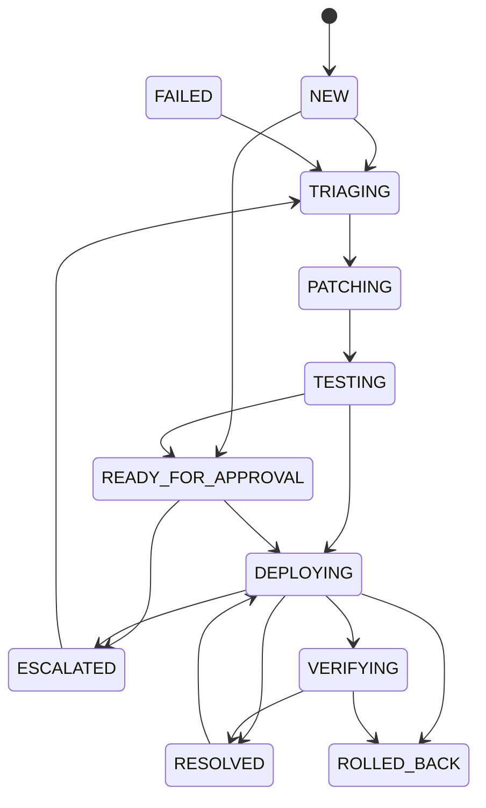

# Mizantra AutoHeal V1 architecture

AutoHeal is a support workflow for small, client-blocking UI defects. It records an incident first, makes deterministic risk decisions, and only considers a web deployment after the changed diff and every validation result pass policy. The feature is not deployed or enabled by this change.

```mermaid
flowchart LR
  UI[Authenticated support UI] --> API[POST /support/incidents]
  API --> SAFE[Input allowlist and redaction]
  SAFE --> DB[(Support incident and audit tables)]
  API --> Q[Bull queue, only if enabled]
  Q --> CLASS[Deterministic incident classifier]
  CLASS --> WT[Incident branch in isolated Git worktree]
  WT --> AGENT[Mock provider or sandboxed Codex CLI]
  AGENT --> DIFF[Post-diff deterministic safety gate]
  DIFF --> TESTS[Focused test, web type-check, build, local route smoke]
  TESTS --> MODE{SHADOW / APPROVAL / AUTO}
  MODE -->|SHADOW| REVIEW[Admin review; no deploy]
  MODE -->|APPROVAL| REVIEW
  MODE -->|AUTO and LOW only| DEPLOY[Fast-forward web target]
  DEPLOY --> SMOKE[Production route and site smoke]
  SMOKE -->|pass| DONE[Resolved]
  SMOKE -->|fail| ROLLBACK[Restore previous SHA, rebuild, restart web, verify]
  ROLLBACK --> AUDIT[Persistent deployment and audit history]
```

## Data and services

`apps/api/src/support-autofix/` contains the incident API, tenant-scoped persistence, deterministic classifier, scoped prompt builder, isolated worktree manager, validation runner, worker API guard, heartbeat support, and standalone Bull coding worker. The normal API process only records incidents and enqueues LOW-risk patch jobs; it does not register a patch processor or Codex provider. The dedicated `autoheal-patch` queue is consumed only by `pnpm autoheal:worker`; human deployment/rollback jobs use a separate queue with no coding-worker handler. Additive schemas are in `migrations/add-support-autofix.sql` and `migrations/add-autoheal-worker-heartbeats.sql`; neither is applied automatically.

The worker has no database credential. It receives tenant/incident IDs from Redis, requests approved incident context over the authenticated worker API, creates one dedicated Git worktree, runs Codex and web-only validation, then posts the diff summary and commit metadata. The API independently re-runs the deterministic diff and validation gate before marking `READY_FOR_APPROVAL`. The coding worker has no deployment or rollback processor.

`/dashboard/support` is the client status and issue form. `/dashboard/support/admin` is the permission-checked engineering control center. Support capture and state changes also write scoped support audit events; the generic audit interceptor skips support request bodies so free text is not copied into general activity logs.

## Incident state machine

The API validates transitions against `incident-state.ts`:

The client sees only plain-language status labels. Detailed branch, file, risk, test, build, and deployment data is restricted to privileged support admins.

## Configuration defaults

- `AUTOHEAL_ENABLED=false`: emergency and initial default kill switch. Incidents are still recorded; no queue job, model call, worktree patch, or deployment runs.
- `AUTOHEAL_MODE=SHADOW`: invalid or missing modes resolve to SHADOW. SHADOW never deploys.
- `AUTOHEAL_AGENT_PROVIDER=mock`: no code is changed unless the sandboxed Codex CLI provider is explicitly selected.
- `AUTOHEAL_BASE_BRANCH=origin/clean-main` and `AUTOHEAL_WORKTREE_ROOT` keep agent edits outside the main worktree.
- `AUTOHEAL_MAX_CHANGED_FILES=5` and `AUTOHEAL_MAX_CHANGED_LINES=250`; configuration can make these stricter, never looser than the hard V1 ceiling.
- `AUTOHEAL_DEPLOYMENT_TARGETS_JSON` is empty by default. Target entries contain public routing/repository/process metadata and a *name* of the environment variable holding the SSH key path; no credential value is stored in the registry or database.

See [AUTOHEAL_SAFETY_POLICY.md](AUTOHEAL_SAFETY_POLICY.md) and [AUTOHEAL_RUNBOOK.md](AUTOHEAL_RUNBOOK.md) for enforcement and operations.
